# 내 컴퓨터에 개발자용 '작업실' 꾸미기


# 미션 요약


# 실행 환경
- OS: macOS 15.7.4
- 쉘: zsh
- 터미널: Apple_Terminal
- Docker 버전: 28.5.2
- Git 버전: 2.53.0


# 수행 항목 체크리스트
- [o] 터미널 조작 로그 기록
- [o] 권한 실습 및 증거 기록
- [o] Docker 설치 및 기본 점검
- [o] Docker 기본 운영 명령 수행
- [o] 컨테이너 실행 실습
- [] 기존 Dockerfile 기반 커스텀 이미지 제작
- [] 포트 매핑 및 접속 증거
- [] Docker 볼륨 영속성 검증
- [] Git 설정 및 Github 연동
- [] 보안 및 개인정보 보호


# 터미널 조작 로그 기록
```zsh
# 현재 위치 확인
pwd
```
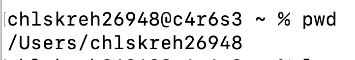
```zsh
# 목록 확인 (숨김 파일 포함)
ls -al
```
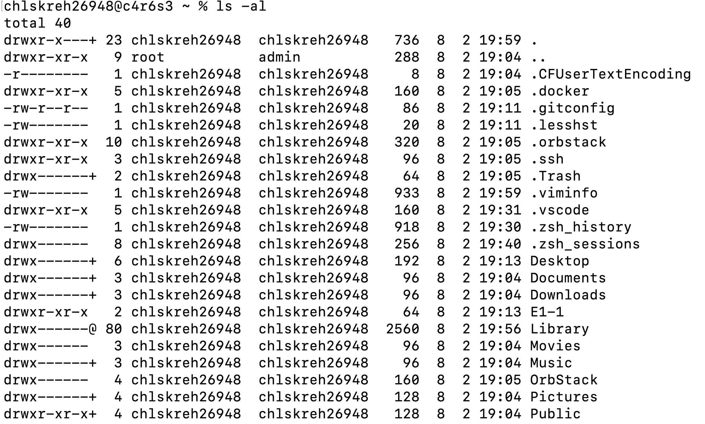
```zsh
# 디렉토리 이동
cd 경로
```
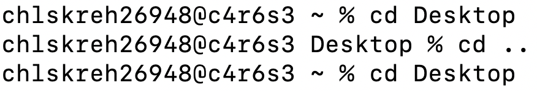
```zsh
# 폴더 생성
mkdir 폴더명
# 빈 파일 생성
touch 파일명.txt
```
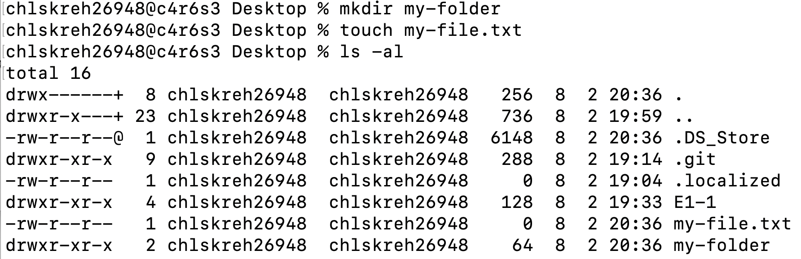
```zsh
# 파일 복사
cp 원본 복사본
# 폴더 복사 (-r: 재귀)
cp -r 원본폴더 복사본폴더
```
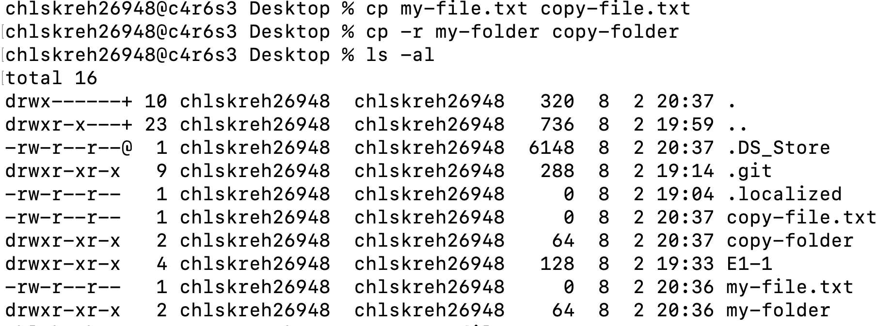
```zsh
# 이름 변경
mv 원본 새이름
# 파일 이동
mv 파일 경로
```
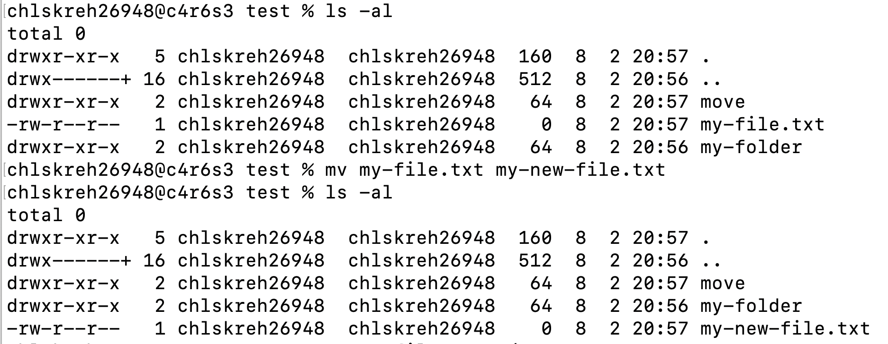
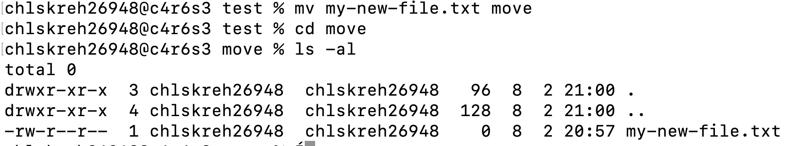
```zsh
# 파일 삭제
rm 파일명
# 폴더 삭제
rm -r 폴더명
```
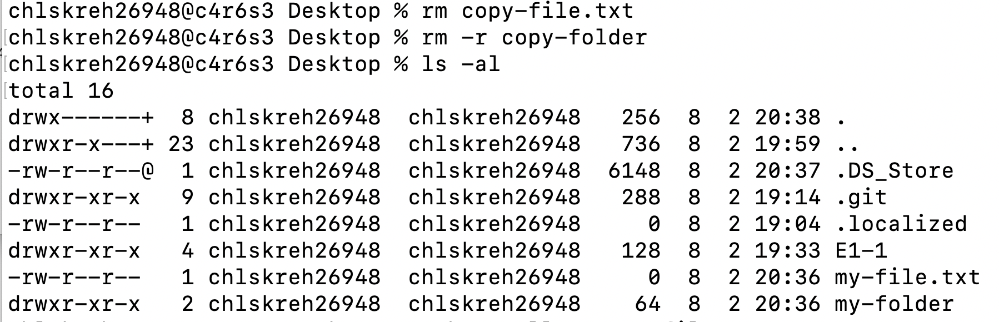
```zsh
# 파일 내용 확인
cat 파일명
```
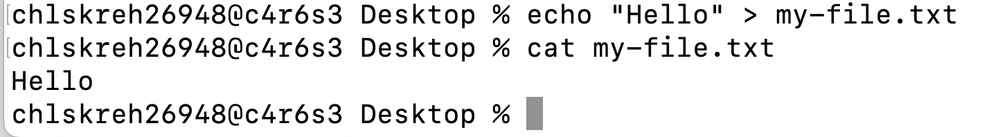


# 권한 실습 및 증거 기록
## 초기 터미널 파일, 폴더 목록  
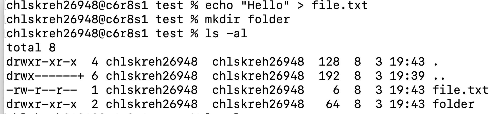
```zsh
# 권한 변경
chmod 숫자 파일/폴더

# 파일
# 읽기(r)   = 파일 내용을 볼 수 있다
# 쓰기(w)   = 파일을 수정/삭제할 수 있다
# 실행(x)   = 프로그램으로 실행할 수 있다

# 폴더
# 읽기(r)   = 폴더 안의 파일 목록을 볼 수 있다 (ls 명령어)
# 쓰기(w)   = 폴더 안에 파일을 만들거나 삭제할 수 있다
# 실행(x)   = 폴더 안으로 진입할 수 있다 (cd 명령어)
```
## 파일  
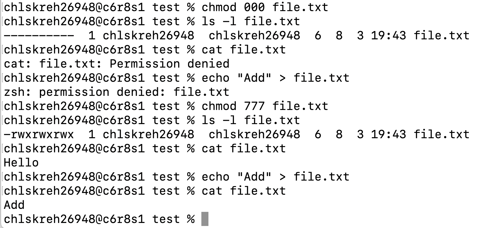
## 폴더  
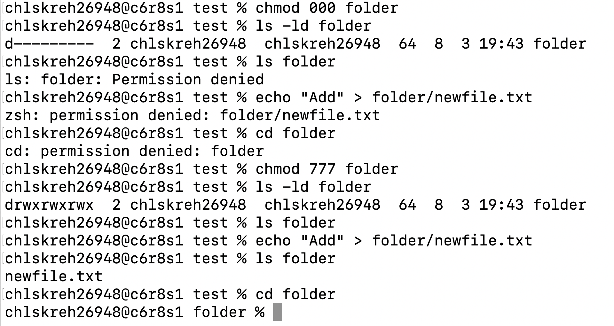


# Docker 설치 및 기본 점검

```zsh
# Docker 버전 확인
docker --version
```
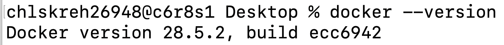
```zsh
# Docker 데몬 동작 여부 확인
docker info
```
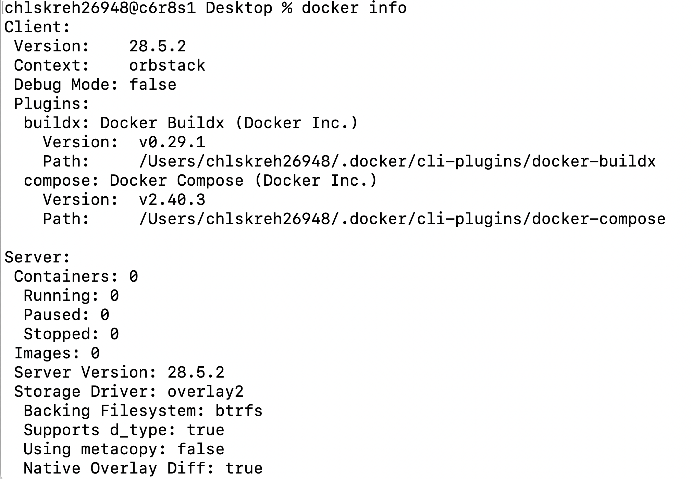


## Docker 기본 운영 명령 수행
```zsh
# Docker 이미지 다운로드
docker pull 다운받을이미지
# Docker 이미지 목록 확인
docker images
```
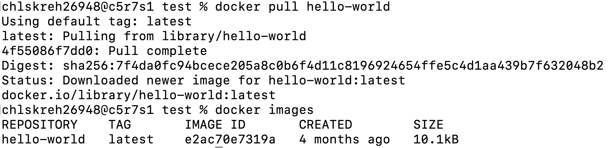
```zsh
# Docker 컨테이너 실행
docker run 실행할이미지
# Docker 실행 중인 컨테이너 목록 확인
docker ps
# Docker 모든 컨테이너 확인 (중지된 것 포함)
docker ps -a
```
## Docker 컨테이너 실행
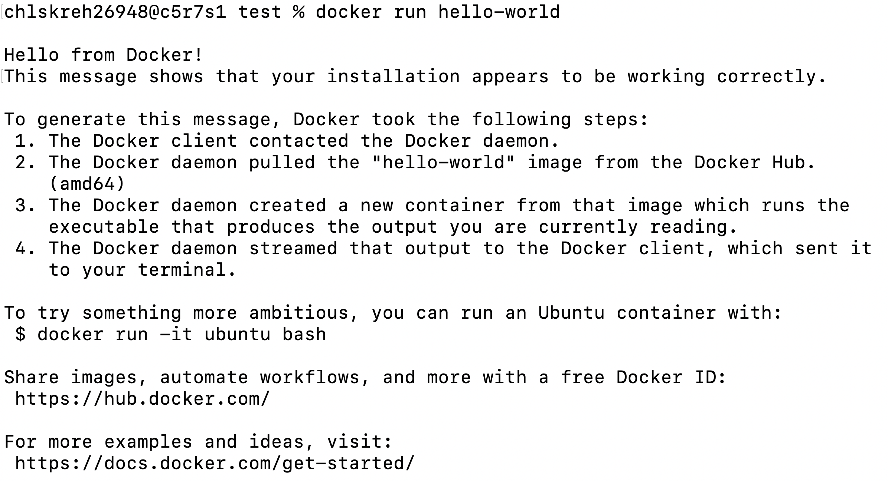
## Docker 실행 중인 컨테이너 목록 확인 | Docker 모든 컨테이너 확인 (중지된 것 포함)
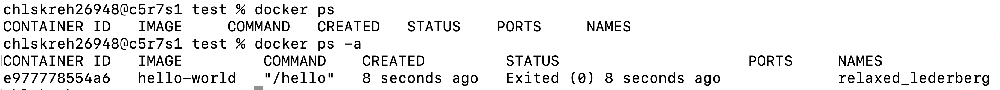
```zsh
# Docker 컨테이너 로그 확인
docker logs <컨테이너ID | 컨테이너이름>
# Docker 실행 중인 컨테이너 리소스 확인
docker stats <컨테이너ID | 컨테이너이름>
```
## Docker 컨테이너 로그 확인
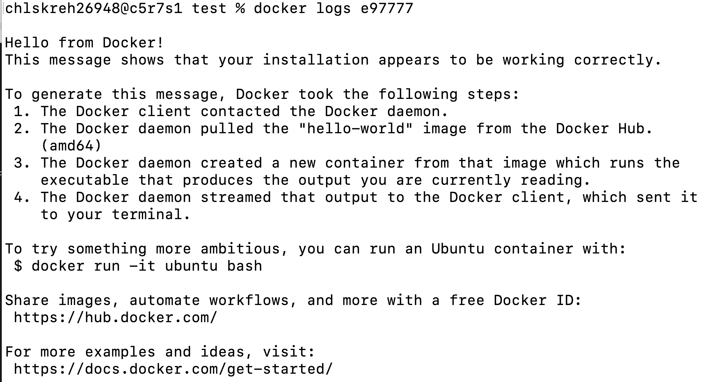
## Docker 실행 중인 컨테이너 리소스 확인
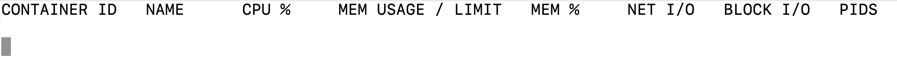


# 컨테이너 실행 실습
```zsh
# Ubuntu 컨테이너 실행 및 내부 진입 (대화형 모드)
docker run -it ubuntu /bin/bash
```
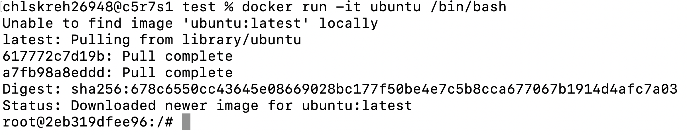
## 컨테이너 내부 명령 실행 결과
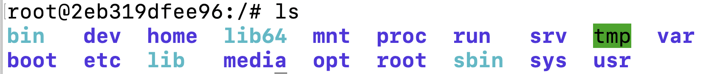
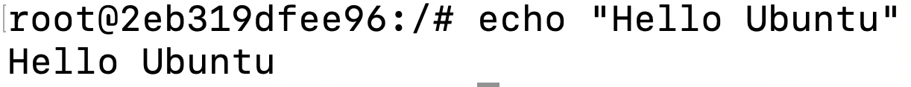
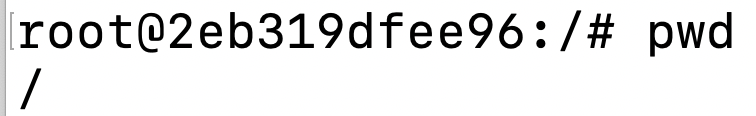


